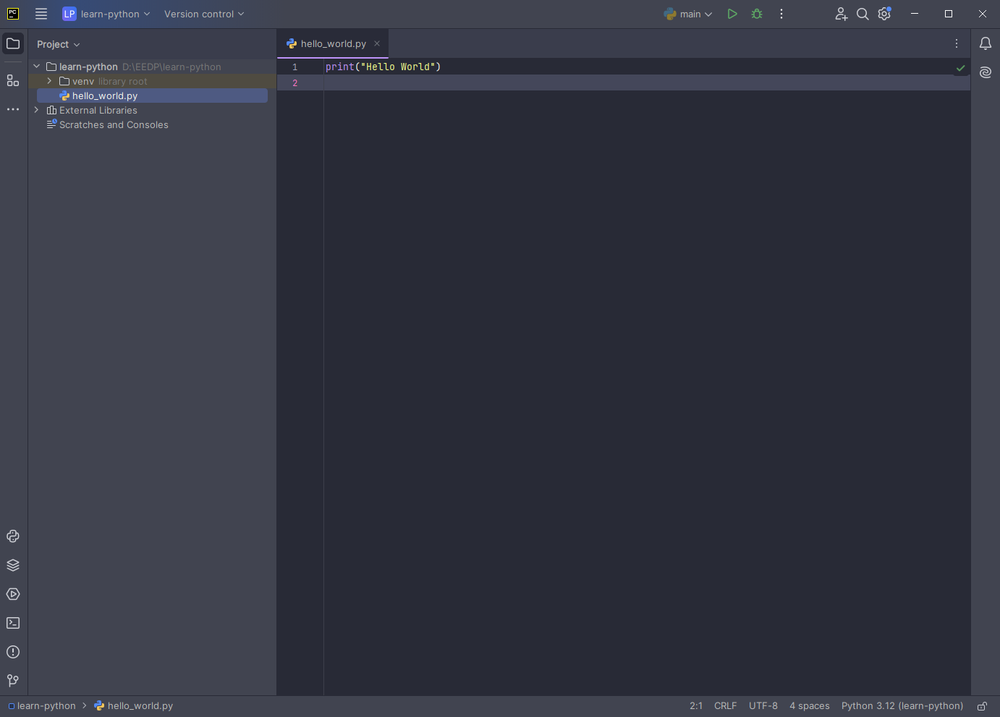

| [< Previous (Quick Intro to Python)](PythonIntro.md) | [Day1](../README.md) | [Next (Python Editing) >](PythonEditing.md) |
|------------------------------------------------------|----------------------|---------------------------------------------|

# Hello World

The PyCharm IDE provides the development environment to create, edit, run, and debug your Python programs.
On the left is a tree view of your project structure and files. On the right is an editor window for typing
code.

## Creating a first project

Our first program will be the "Hello World" program. This is traditionally the first program used to introduce language,
syntax, and environment to people learning to program. Select File->New Project to create a new project.

### Creating a new Python file

To create your `hello-world.py` file, right-click on your project to bring up the menu.
Select New->Python File.


You will then be prompted for a file name. Enter `hello-world.py`:


You will now see a blank editor window (hello-world.py). This is where we type our first
program. Notice that the project tree on the left shows *hello-world.py* as part of your project.


### Edit your program

Type in your first program. Here we will use the built-in `print` function to output a string to the console.

```python
print("Hello World")
```



### Ready to Run

Right-click on your file in the project tree, and select **Run**


### Results

Notice in the bottom pane of your IDE, you see the console showing your program's output.


| [< Previous (Quick Intro to Python)](PythonIntro.md) | [Day1](../README.md) | [Next (Python Editing) >](PythonEditing.md) |
|------------------------------------------------------|----------------------|---------------------------------------------|
