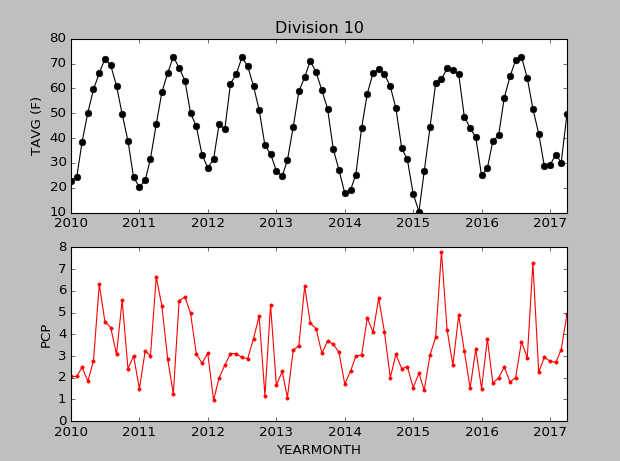

| [< Previous (Setup)](Setup.md) | [Day1](../README.md) | [Next (Quick Intro to Python) >](PythonIntro.md) |
|--------------------------------|----------------------|--------------------------------------------------|

# Session Objectives

At the end of this 4 day session, you will be able to read in data, perform analysis, and display both data and results
as visually appealing plots, as shown below. We will use weather data for our exercise.

To get here, we will go through

- Setting up the Python environment
- Writing a simple program
- Understanding programming concepts and constructs
- Using the constructs to iteratively improve the program
- Resolving errors (debugging) in the program
- Collaborating effectively with version control
- Understanding automated tests

| [< Previous (Setup)](Setup.md) | [Day1](../README.md) | [Next (Quick Intro to Python) >](PythonIntro.md) |
|--------------------------------|----------------------|--------------------------------------------------|
