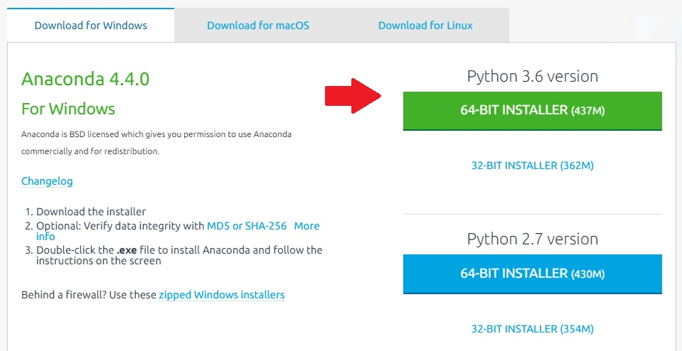

| [< Previous (Intro)](../README.md)  | [Day1](../README.md)| [Next (Session Objectives) >](SessionObjectives.md) |
|----|----|----|
# Environment Setup

On the first day, the class will setup a python environment on your laptop.

### Prerequisite Software

You will need a python environment, Git version control client, and IDE to participate in this 
course.

1. Download and install [Anaconda](https://www.continuum.io/downloads)
2. Download and install [Git](https://git-scm.com/book/en/v2/Getting-Started-Installing-Git)
3. Download and install [PyCharm Community Edition](https://www.jetbrains.com/pycharm/download/)

### Further Notes

<u>Anaconda</u>

- In our classes, we shall use **Python 3.6**; hence download the Python 3.6 version of Anaconda
- Most of the laptops we use today are 64-bit machines, running Windows 7. To confirm, checkout the instructions [here](https://support.microsoft.com/en-us/help/827218/how-to-determine-whether-a-computer-is-running-a-32-bit-version-or-64-bit-version-of-the-windows-operating-system)
- Your Anaconda download screen will (most probably) look like this. Download the 64-bit installer (pointed to by the red arrow)

| [< Previous (Intro)](../README.md) | [Day1](../README.md) | [Next (Session Objectives) >](SessionObjectives.md) |
| ---- | ---- | ---- |
