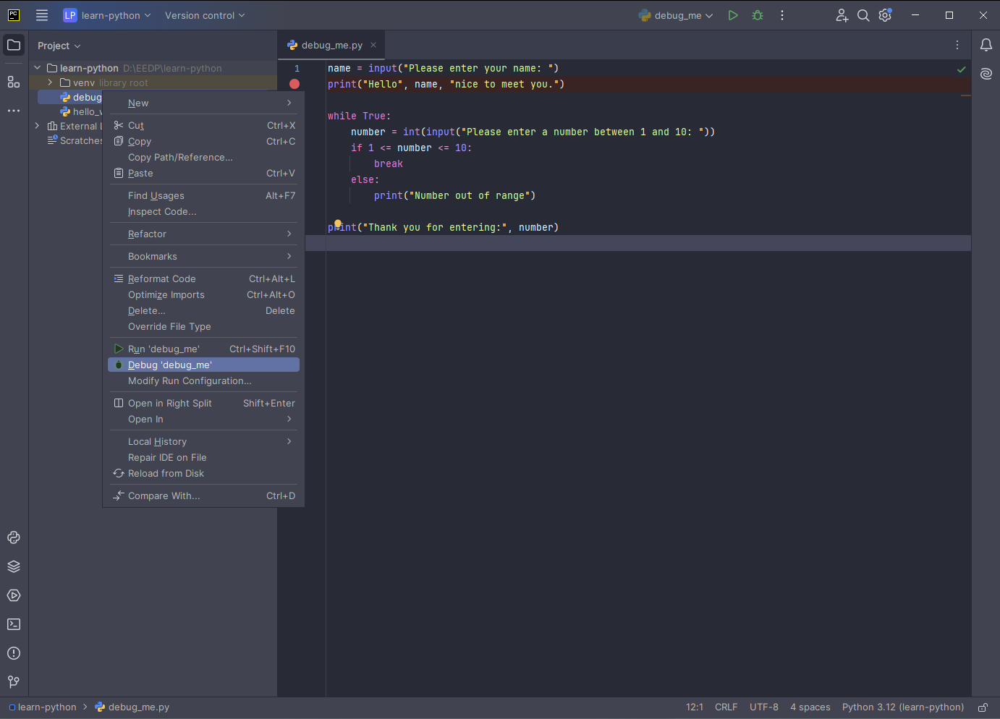

|[< Previous (Functions) >](Functions.md) | [Day3](../README.md)| [Next (Software Testing) >](Testing.md) |
|----|----|----|
# Debugging

The PyCharm IDE provides a full GUI debugger that allows the developer to step through the 
execution of their program, set breakpoints, inspect, and modify variables.  A debugger
provides a powerful tool that every developer should know how to use.

## Setting breakpoints

Breakpoints are a way to define a location where you want to pause the program execution.
Consider the following program:

```python
name = input("Please enter your name: ")
print("Hello", name, "nice to meet you.")

while(True) :
    number = int(input("Please enter a number between 1 and 10: "))
    if number >= 1 and number <= 10:
        break
    else:
        print("Number out of range")

print("Thank you for entering:", number)
```

### Create new program

Create a new python file, debugme.py, and enter the above program.


### Set Breakpoint

To set a breakpoint, click in the margin between the line number and the statement. A breakpoint
is indicated by a red circle.


### Start Debugger

To start the debubber, right click on the file in your project tree.  Instead of selecting
"Run", as we did last time, this time select "Debug"



###

Your application will start, and you will see the console in the bottom of the screen
prompting the user to enter their name:


After entering your name, the program continues until it hits the defined breakpoint, which
happens to be the very next line.  You will see in Debugger tab, we can inspect and modify
variables that are in scope.


We will right-click on the _name_ variable and change the contents of the variable from 'Walt'
to 'Fred'.


We can now single step over (F8) the statements in or program, or use the run menu to control 
program execution.


After stepping over (F8)(F8), the highlighted line shows we are about to execute the
input statement... 


Stepping over again (F8) will prompt the user to enter the number. You will have to 
switch from the Debugger tab to the Console tab in order to enter the number.


You can continue to single step over (F8) and follow the flow of the program. 
Once you are finished stepping, you can tell the program to continue (F9). 
The program will then resume running normally unless it encounters another
breakpoint, at which point the program will pause and allow you to inspect and
modify variables again.

|[< Previous (Functions) >](Functions.md) | [Day3](../README.md)| [Next (Software Testing) >](Testing.md) |
|----|----|----|
