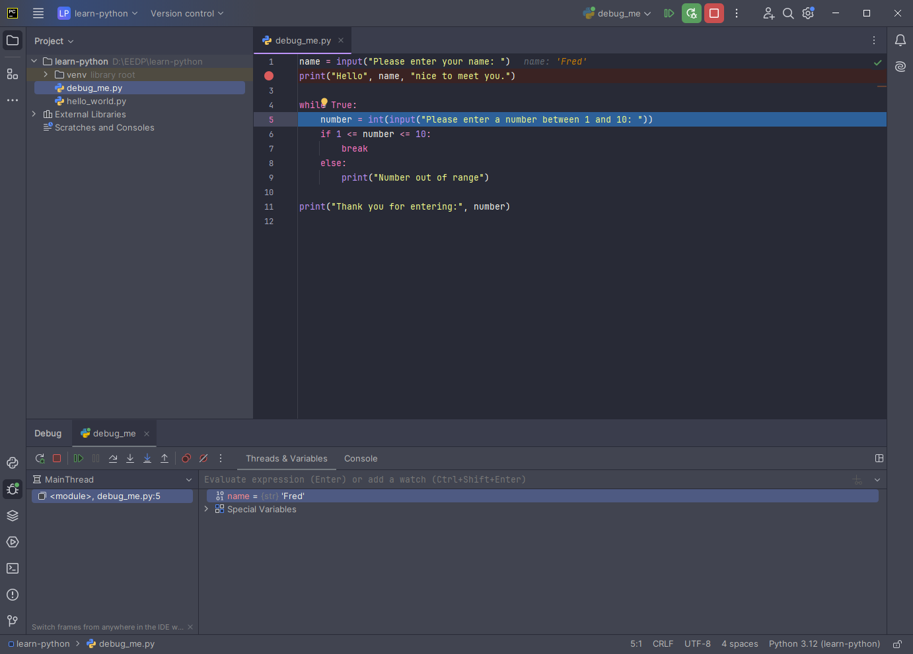

| [< Previous (Day2 - Dictionaries)](../Day2/Dictionaries.md) | [Day3](../README.md) | [Next (Functions) >](Functions.md) |
|-------------------------------------------------------------|----------------------|------------------------------------|

# Debugging

There are 3 main types of programming errors:

- syntax
- semantic
- logic

Syntax errors are essentially bad grammar in your program where you don't follow the rules. The IDE (editor) or compiler
will usually highlight these so you can fix them.

Semantic errors cause the program to "crash" or have a runtime error. These occur when you "misuse" the language, like
trying to read data from a variable that you haven't initialized or treating a string like a number.

Logic errors are where the program executes and even gives a result, but is not doing what you intended. For instance,
creating a function to sum two numbers, but implementing it as `a - b`. These can happen when programmers "cut & paste"
similar code, don't understand the requirements, change the meaning of a function that someone else is using, and many,
many more reasons. These can be especially difficult, because you may not even realize you have a problem - this is
where software testing (we'll discuss later) can help.

To get rid of Semantic and Logic errors, programmers "debug" the program. The PyCharm IDE provides a full GUI debugger
that allows the developer to step through the execution of their program, set breakpoints, inspect, and modify
variables. A debugger provides a powerful tool that every developer should know how to use.

## Setting breakpoints

Breakpoints are a way to define a location where you want to pause the program execution.
Consider the following program:

```python
name = input("Please enter your name: ")
print("Hello", name, "nice to meet you.")

while True:
    number = int(input("Please enter a number between 1 and 10: "))
    if 1 <= number <= 10:
        break
    else:
        print("Number out of range")

print("Thank you for entering:", number)
```

### Create new program

Create a new Python file, `debug_me.py`, and enter the above program.


### Set Breakpoint

To set a breakpoint, click in the margin between the line number and the statement. A breakpoint
is indicated by a red circle.


### Start Debugger

To start the debugger, right-click on the file in your project tree. Instead of selecting
"Run", as we did last time, this time select "Debug"


###

Your application will start, and you will see the console at the bottom of the screen
prompting the user to enter their name:


After entering your name, the program continues until it hits the defined breakpoint, which
happens to be the very next line. You will see in Debugger tab, we can inspect and modify
variables that are in scope.


We will right-click on the *name* variable and change the contents of the variable from 'Walt'
to 'Fred'.


We can now single step over (F8) the statements in or program, or use the run menu to control
program execution.


After stepping over (F8)(F8), the highlighted line shows we are about to execute the
input statement...



Stepping over again (F8) will prompt the user to enter the number. You will have to
switch from the Debugger tab to the Console tab in order to enter the number.


You can continue to single step over (F8) and follow the flow of the program.
Once you are finished stepping, you can tell the program to continue (F9).
The program will then resume running normally unless it encounters another
breakpoint, at which point the program will pause and allow you to inspect and
modify variables again.

| [< Previous (Day2 - Dictionaries)](../Day2/Dictionaries.md) | [Day3](../README.md) | [Next (Functions) >](Functions.md) |
|-------------------------------------------------------------|----------------------|------------------------------------|
