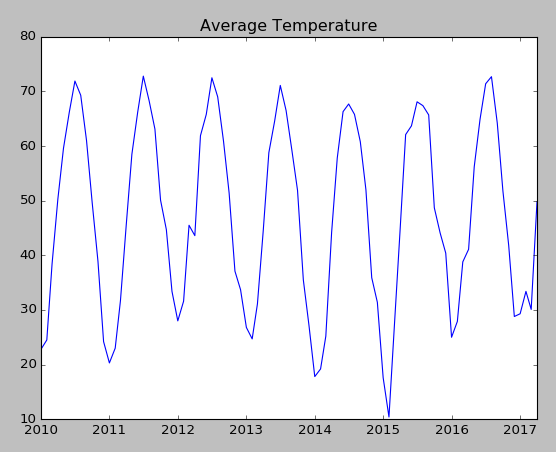
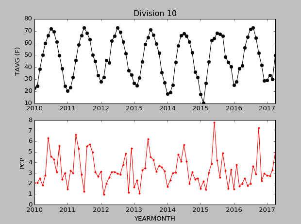

[< Previous (CSV Files)](CSVFiles.md) | [Day3](../README.md)| [Next (Day4)](../README.md)| |
|----|----|----|

# Simple Plotting

Now that we have loaded the weather data, let's create a few plots. There are many plotting packages available.
Here we are going to use the [matplotlib](https://matplotlib.org/) package to create some plots.


## Using matplotlib

Before we can use the matplotlib library, we must import it
```python
import matplotlib.pyplot as plt
```

## Simple X, Y Plot

To create an X, Y plot, the arrays of the X and Y values are simply passed to the ```plot()``` function

```python
def plot_tavg(array_YEARMONTH, array_TAVG):
    plt.plot(array_YEARMONTH, array_TAVG)
    plt.title('Average Temperature')
    plt.show()
```


To use this function, we need to get the data from our map into arrays. This little function will loop through our dictionary and pull out data from a particular attribute.

```python
# Extract attribute from dictionary as an array
def create_attribute_array (data, attribute):
    a = []
    for x in data:
        a.append( x[attribute] )
    return a
```
### Exercise

Add the import statement to the top of your readweather.py file.
Add the plot_tavg function to the file.
Add the create_attribute_array function to the file.
Update your main section to
1) Select one of the divisions from the data map.
2) Create attribute array objects for the YearMonth attribute and the TAVG attribute.
3) Call the plot_tavg function with the YearMonth as first input and TAVG as second.

The plot shown above is for division 10.

## Multiple sub-plots

Often it is useful to plot several plots together. Below two subplots are created, one for Average Temperture and another for Precipitation.

```python
def plot_division (division_data):

    array__DIVISION = create_attribute_array(division_data, 'Division')
    array_YEARMONTH = create_attribute_array(division_data, 'YearMonth')
    array_TAVG = create_attribute_array(division_data, 'TAVG')
    array_PCP = create_attribute_array(division_data, 'PCP')

    plt.subplot(2, 1, 1)
    plt.plot(array_YEARMONTH, array_TAVG, 'ko-')
    plt.title('Division ' + str(array__DIVISION[0]))
    plt.ylabel('TAVG (F)')

    plt.subplot(2, 1, 2)
    plt.plot(array_YEARMONTH, array_PCP, 'r.-')
    plt.xlabel('array_YEARMONTH')
    plt.ylabel('PCP')

    plt.show()
```



### Exercise

Add the plot_division function to the file.
Update your main section to call the plot_division function instead of create_attribute_array and plot_tavg.


### Exercise

Modify your program to plot your data in Celsius units instead of Fahrenheit.

