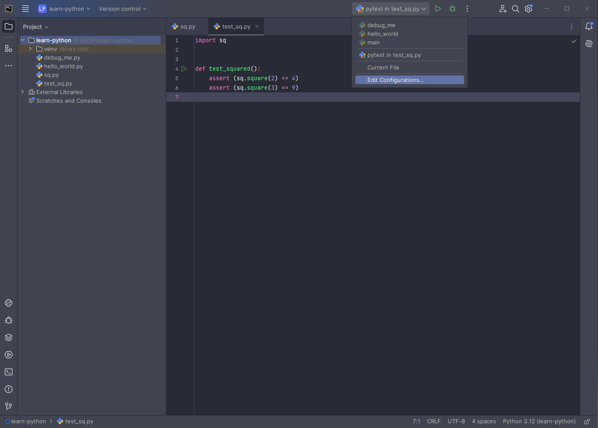
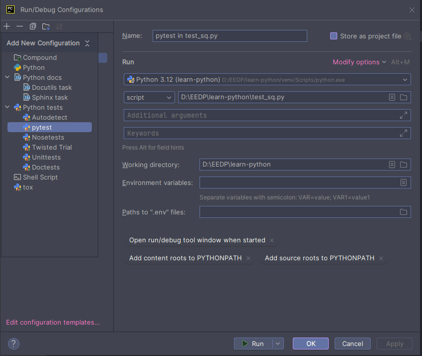
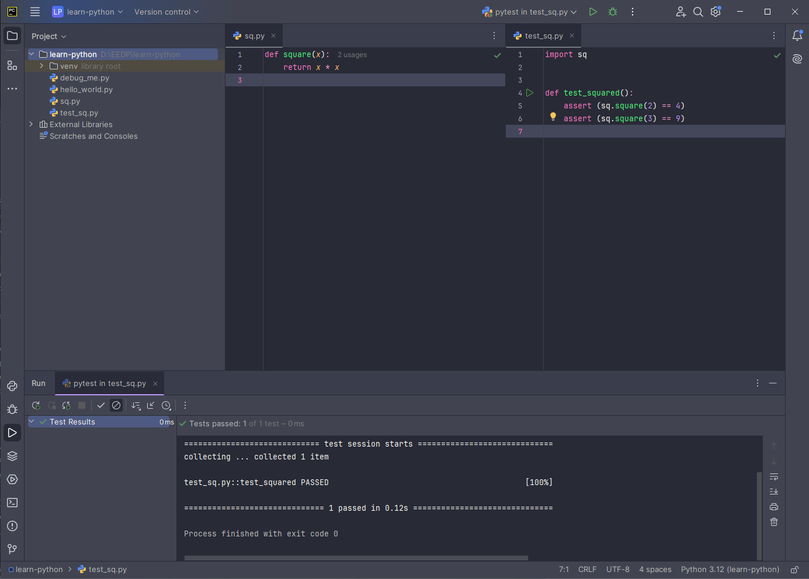
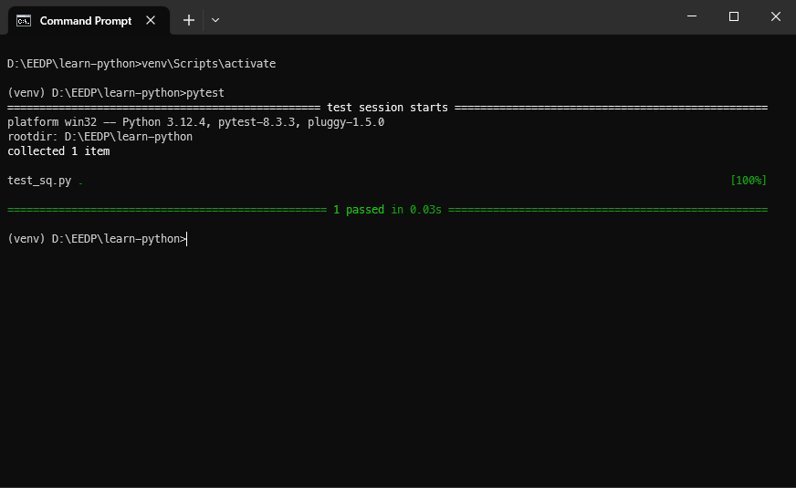

| [< Previous (Modules)](Modules.md) | [Day3](../README.md) | [Next (Day 4 Source Code Mgmt) >](../Day4/GitOverview.md) |
|------------------------------------|----------------------|-----------------------------------------------------------|

# Software Testing

As software developers we want to ensure that the code we develop is free of bugs and works as expected. We either share
our code with other developers or the output generated by the program is shared and consumed by others.

In general, there are two kinds of software testing:

* Unit Testing: Testing of each module or function to show individual parts are working correctly.
* Integration Testing: Testing that the execution of a group of modules work correctly when combined.

Below we will show how to write unit tests using [pytest](https://docs.pytest.org/en/latest/).

## Writing Unit Tests in Python

Pytest is a framework for writing tests and provides tools to execute our code and validate that the values returned 
have the correct values.

As an example, suppose we have defined the following function for the square of a number in a file `sq.py`:

```python
def square(x):
    return x * x
```

Pytest provides a library of assertion functions to help check return values and ensure they are returning proper
values. Assert functions are used to verify expectations and values in Python tests. Pytest will find the tests in
files that start with the prefix `test_` (or end with the suffix `_test`).

For example, let's write a unit test for our `square(x)` function above (in a file call `test_sq.py`:

```python
import sq


def test_squared():
    assert (sq.square(2) == 4)
    assert (sq.square(3) == 9)
```

## Running pytest

To run tests in PyCharm using pytest you may need to manually add a run configuration. You can do so by clicking on the 
run configuration dropdown in the upper-right and selecting `Edit Configurations...`.



In the `Run/Debug Configurations`, click on the plus sign in the upper-left and select the `pytest` option. Ensure that 
the correct Python interpreter is selected, set `script` to the path of your test file, and set `Working directory` to 
the directory of your project. Click `Apply`/`OK` or `Run` to close the dialog.



When we run the program using pytest in PyCharm, we see that the test executes successfully.



Tests can also be run from a command shell by activating the Python virtual environment (with `venv\Scripts\activate`) 
and executing `pytest` from the same folder as the test source files. For example:



## Writing a Unit Test for Temperature Conversion

Next, let's write a unit test for the temperature conversion routine from the previous example in the Function chapter, 
`temperature_conversion.py`:

```python
# Convert Fahrenheit to Celsius
def convert_f_to_c(temperature_f):
    temperature_c = (float(temperature_f) - 32) * (5.0 / 9.0)
    return temperature_c
```

We know that 32 degrees Fahrenheit is the same as 0 degrees Celsius and that 212 degrees Fahrenheit is 100 degrees
Celsius. So, we have the following unit test in `test_temperature_conversion.py`:

```python
import temperature_conversion as tc


def test_conversion():
    assert (tc.convert_f_to_c(32) == 0)
    assert (tc.convert_f_to_c(212) == 100)
```

Run the test and observe the result.

| [< Previous (Modules)](Modules.md) | [Day3](../README.md) | [Next (Day 4 Source Code Mgmt) >](../Day4/GitOverview.md) |
|------------------------------------|----------------------|-----------------------------------------------------------|
