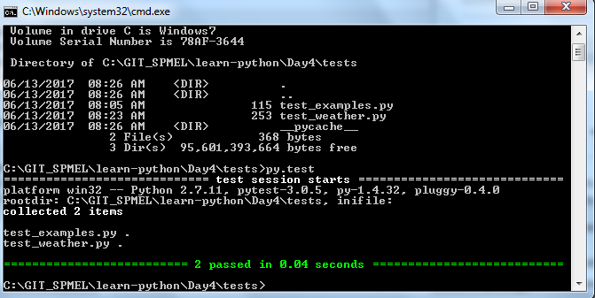

[< Previous (Data Analysus)](DataAnalysis.md) | [Day4](../README.md)| [Next (Additional Resources) >](../AdditionalResources.md) |
|----|----|----|

# Software Testing

As software developers we want to ensure that the code we develop is free of bugs and works as expected. We either share our code with other developers or the output generated by the program is shared and consumed by others.

In general, there are two kinds of software testing:

* Unit Testing: Testing of each module or function to show individual parts are working correctly.
* Integration Testing: Testing that the execution of a group of modules work correctly when combined together.

Below we will show how to write unit tests using [pytest](https://docs.pytest.org/en/latest/)

## Writing Unit Tests in Python

[pytest](https://docs.pytest.org/en/latest/) is a framework for writing tests. The framework provides tools to execute your code and validate that the values returned have the correct values.

As an example, suppose we have defined the following function for the square of a number:

```python
def square(x):
    return x*x
```

```pytest``` provides a library of assertion functions to help check return values and ensure they are returning proper values. Assert functions are used to verify expectations and values in Python tests.

For example, let's write a unit test for our ```square(x)``` function above:

```python
def test_squared():
    assert( square(2) == 4)
    assert( square(3) == 9)
```

When we run the program using py.test in PyCharm, we see that the tests execute successfully


## Writing a Unit Test for Temperature Conversion

Next, let's write a unit test for the temperature conversion routine from the weather example:

```python
# Convert Fahrenheit to Celsius
def convertFtoC (temperatureF):
    temperatureC = (float(temperatureF) - 32) * (5.0/9.0)
    return temperatureC
```

We know that 32 degrees Fahrenheit is the same as 0 degrees Celsius and that 212 degrees Fahrenheit is 100 degrees Celsius. So, we have the following unit test:

```python
def test_conversion():
    assert (convertFtoC(32) == 0)
    assert (convertFtoC(212) == 100)
```

Tests can also be run from a command shell by executing ```py.test``` from the same folder as the test source files. For example:

