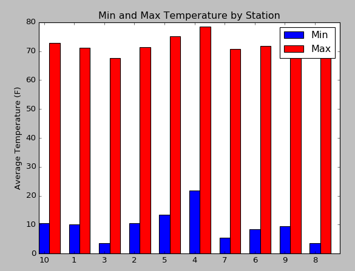

| [< Previous (Day 4 - Plotting)](../Day4/SimplePlotting.md) | [Extras](../README.md) | [Next (Git - Saving your work) >](GitChanges.md) |
|------------------------------------------------------------|------------------------|--------------------------------------------------|

# Data Analysis

Often we do some additional analysis on the data before plotting results. Let's extend the weather example to calculate
the following for the data for each weather station:

* Calculate minimum and maximum temperate
* Calculate the average precipitation

## Calculating Stats For Each Station

In the weather example, the data has been loaded into a dictionary with the station (division) as the key. Let's write a
new routine called `perform_analysis()` to iterate over the stations in the map. We can leverage the
`create_attribute_array()` routine to extract the temperature and precipitation values into an array:

```python
def perform_analysis(data_map):
    stats = []
    for division in data_map:
        division_data = data_map[division]
        array_tavg = create_attribute_array(division_data, 'TAVG')
        array_pcp = create_attribute_array(division_data, 'PCP')

        # Calculate stats for each station

    return stats
```

Python has some built-in functions for obtaining the min and max of an array. However, there is not a built-in function
for the mean, so let's create a simple one:

```python
# Calculate the mean of an array
def mean(a):
    return sum(a) / float(len(a))
```

Let's compute our stats for a station:

```python
def perform_analysis(data_map):
    stats = []
    for division in data_map:
        division_data = data_map[division]
        array_tavg = create_attribute_array(division_data, 'TAVG')
        array_pcp = create_attribute_array(division_data, 'PCP')

        # Calculate stats for each station
        max_tavg = max(array_tavg)
        min_tavg = min(array_tavg)
        mean_pcp = mean(array_pcp)
    return stats
```

Now that we have the desired values in an array, we can return the statistics in an array of dictionary objects:

```python
def perform_analysis(data_map):
    stats = []
    for division in data_map:
        division_data = data_map[division]
        array_tavg = create_attribute_array(division_data, 'TAVG')
        array_pcp = create_attribute_array(division_data, 'PCP')

        # Calculate stats for each station
        max_tavg = max(array_tavg)
        min_tavg = min(array_tavg)
        mean_pcp = mean(array_pcp)

        station_stats = {
            "station": int(division),
            "max_TAVG": max_tavg,
            "min_TAVG": min_tavg,
            "mean_PCP": mean_pcp
        }
        stats.append(station_stats)
    print(stats)
    return stats
```

## Plotting the Results as a Bar Chart

Again, we leverage the  [matplotlib](https://matplotlib.org/) package to plot some charts. Here we create a bar chart
showing the min and max average temperatures for each station

```python
import numpy as np


def plot_min_max(station_stats):
    array_station = create_attribute_array(station_stats, 'station')
    array_min_tavg = create_attribute_array(station_stats, 'min_TAVG')
    array_max_tavg = create_attribute_array(station_stats, 'max_TAVG')
    array_mean_pcp = create_attribute_array(station_stats, 'mean_PCP')

    n = len(array_station)
    ind = np.arange(n)  # the x locations for the groups

    width = 0.35  # the width of the bars
    fig, ax = plt.subplots()
    rects1 = ax.bar(ind, array_min_tavg, width, color='b')
    rects2 = ax.bar(ind + width, array_max_tavg, width, color='r')

    # add some text for labels, title and axes ticks
    ax.set_ylabel('Average Temperature (F)')
    ax.set_title('Min and Max Temperature by Station')
    ax.set_xticks(ind + width / 2)
    ax.set_xticklabels(array_station)
    ax.legend((rects1[0], rects2[0]), ('Min', 'Max'))
    plt.show()
```

The resulting chart:



| [< Previous (Day 4 - Plotting)](../Day4/SimplePlotting.md) | [Extras](../README.md) | [Next (Git - Saving your work) >](GitChanges.md) |
|------------------------------------------------------------|------------------------|--------------------------------------------------|
