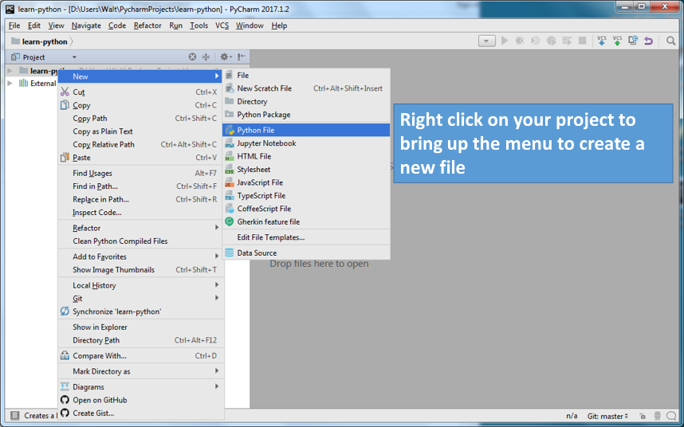
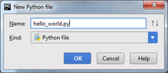
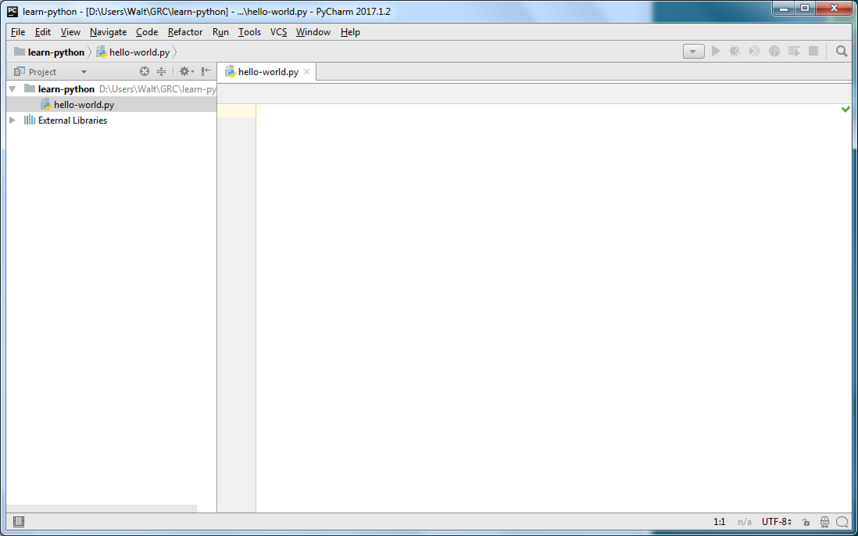
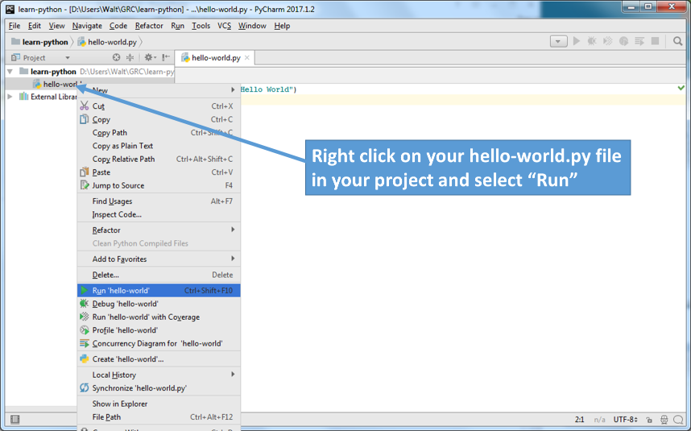
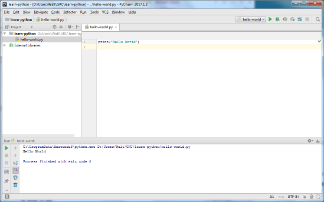

# Hello World

The Pycharm IDE provides the development environment to create, edit, run and debug your
python programs.

## Creating a first project

Our first program will be the traditional "Hello World" program. This program is traditionally
first program used to introduce language, syntax and environment to people learning to program.

### Creating a new python file

To create your hello-world.py file, right click on your project to bring up the menu. 
Select New->Python File.

You will then be prompted for a file name. Enter hello-world.py:

You will now see a blank editor window (hello-world.py). This is where we type our first 
program. Notice the project tree on the left shows that hello-world.py is part of your project.

### Edit your program

Type in your first program. Here we will use the built-in *print* function to output a string to the console.

### Ready to Run

Right click on your file in the project tree, and select "Run"

### Results

Notice in the bottom pane of your IDE, you see the console showing your programs output.

### Excercise

Now change the message to make things more interesting.
